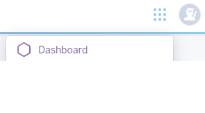
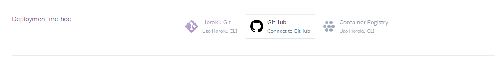

# WikiPride

Welcome to WikiPride. This is a webiste for Code Institute July 2024 Hackathon which has a theme of ProudCoders and is about inclusivity.

To access the site [WikiPride](https://wiki-pride-8a928859e1df.herokuapp.com/)

## Introduction

The site is designed to follow the 'Wiki' format. It contains information for people who want to know about

With a team mainly consisting of people who were only familiar with HTML and CSS languages. We started with some 

## UX design

With a team mainly consisting of people who were only familiar with HTML and CSS languages. We started with some ambitious ideas involving utilising already exising API's full of relevant data, or filters for photographs. It was quickly realised that with the amount of time we needed get a viable site complete so the API was beyond reasonable scope. The filters although fun had no real life application.

The wiki format was chosen as it would be interesting for us to gain insight into genuine information for the team and as everyone wanted to do at least some coding would allow that to happen.

The design process started with a lot of sketches and wireframes. Alongside these the 5 planes of UX design were determined.

### Wireframes and Sketches

In chronological order

[First Wireframe](./wiki_pride_app/static/images/wikiPride.pdf)

[First Sketch](./wiki_pride_app/static/images/sketch1.jpg)

[Second Sketch](./wiki_pride_app/static/images/sketch2.jpg)

[Discussion drawing](./wiki_pride_app/static/images/discussion.png)

[Ready to implement wireframe](./wiki_pride_app/static/images/finalWireframes.pdf)

### Why Django, HTML and CSS were used

As half of the team appeared to be able to use Django and bootstrap the initial plan was to use Django and Bootstrap 

### 5 planes of UX design

1. STRATEGY (what do we want to achieve with our project):

    Resource / hub where people can connect, learn and share about topics related to LBGTQIA+.

2. SCOPE (How to deliver the strategy):

    1. Clarity on what the page is about from the get go.
    2. Information in LGBTQIA+
        1. Laws & Rights
        2. Discrimination & Challenges
        3. Coming out.
    3. Raise awareness
        1. History and milestones
        2. Terminology
        3. Health and Wellbeing
    4. Community
        1. Culture and Media
        2. Support
        3. Personal Stories
    5. Events
        1. Celebrations
        2. Experts / Asylum Resources
        3. Activism

STRUCTURE (How to Navigate the website):

* 5 Pages.
* 5 Different topics
* Landing Page - Keep it simple:
    * Title
    * Branding - punchy statement
    * Options to move within the website aka navigation options.
    * Sign-up
* information page: simple layout, similar to a newspaper? Make sure the layout doesn’t become overstimulating. Should have a headline and small description of each information section? Check page then, answers and advice section. Potentially this is fitting?
* Awareness: 
* Community: post-system, similar to a social app? Do we want to add options to answer, like…
* Events: similar to Eventbrite? Could be a similar style as the them page answers and advice section. Little animators of an event, to be expanded upon clicking?
* well need a sign up page
* IDENTITY:
    * EFFECTIVE
        * Simplicity - to understand information
        * Factual - in information presentation
        * Engaging - you’re stimulated but not too much
    * OUTSPOKEN
        * Bold - Strong message and identity
        * Friendly - Welcoming
        * Inspiring - Self-explanatory
    * COHESIVE
        * Uniform - Constant and familiar layout
        * Identifiable - Brand
        * Guided - Easy to jump from topic to topic.

SKELETON (sketches of what will the website look like):

Refer back to wireframes above.

The above is the basis of the original design of the site to which we have maintained as far as possible.

### Colour themes

The flag for all of the LBGTQIA+ community is bright versions of the colours red, orange, yellow, green, blue and purple. Therefore, we decided that these colours should be the ones that we retained to use throughout the site. For simplicity and as there are slightly different shades on different prints of the flat it was decided to use the named colours that are provided in css.

Snow (off white) was chosen as the background colour during the Final wireframes development to avoid any risk of clash of colours as with such a vibrant colour scheme it would potentially risk clash if a coloured or patterned background was chosen.

### Cards

To retain consistency across all pages it was decided that all the pages would be based on the cards visual. All information would be put onto cards on a white background so that whichever colour the cards were there was no clash.

There was the intention that these cards would be created/animated with expand etc using bootstrap, unfortunately the member of the team that was expected to be able to complete this coding was unavailable and it was created using CSS, which reduced the functionality of these cards from the original design.

## Features

### Existing Features

#### Landing/Index page

We wanted this to be a bright welcoming page which was bold, without clutter, so that you could choose using the cards (or nav links) which part of the wiki you were interested in. Ultimately the wiki was going to have lots of pages and to contain something specific on the landing page wasn't the aim of the site.

#### Events page

This is a page where if groups or people want to provide details to the administrators of the site then they can have this added with a title description and if they like a time.

#### Future Feature page

There were several buttons etc that were initially introduced that we didn't know if we were going to have time to complete. To ensure that every button went somewhere we produced a page that was to show that the area was under development and was a future feature.

#### Get to know page

This page was to provide a page that enabled someone who didn't have much knowledge of the topic to get to know what it was all about.

#### Sign up page

This page is designed so that when the future development of posting and timelines or blogs was introduced there was a page to do the sign up. In line with a PP1 project it is displayed but the data does not store.

#### Creators page

This page was an explanation of our vision and to let people know who was behind the site and what work they had contributed to the site.

#### Site consistency

To ensure consistency through out the site extensive wireframes were created and all pages were based on a card system layout and pride colours were use thorughout keeping it bold and bright.

#### Emergency leave button

As it is difficult for some people to browse this kind of content we provided a quick escape button which if pressed took you to google so if interrupted a person who was uncomfortable or in danger looking at the site quick removed all content from the screen replacing it with google.

### Potential Future Feature Developments 

There were several pages that content was looked at that had to be dropped along the way due to time constraints that should future work be done these interesting subjects could be put on informative pages.

#### Posting or blogging

It would be nice if the community had a safe moderated space where they could come to chat and post on a timeline or blog. This is definitely a feature that we would have liked to be available.

#### Social interactions

The footer contains social links for someone feeling isolated to sign up to one of these social networks. In the future it would be good to connect them to relevant pages.

## Bugs

1.Git

Most of the challenges of the team were based around using Git in a collaborative manner as the team had only one active member who had used Git collaboratively previously and some of the members hadn't used Git at all.

We had merge conflicts which were resolved through manually going through the code and selecting the correct items either in Github or the IDE depending on where the merge conflict appeared.

As each contributor set up their own (or several of their own - depending on the individuals preferred working method) branches, we had problems where restarts of computers or IDE's had returned them to the main branch and therefore needed to switch to their own branch again.

Couldn't get CSS onto Heroku but realised that we hadn't collected the static 

```python manage.py collectstatic```

also we hadn't set up Whitenoise.

### Unsolved bugs

None.

## Technologies

### Languages used

- [HTML](https://developer.mozilla.org/en-US/docs/Web/HTML) was used for the coding of the site.
- [CSS](https://developer.mozilla.org/en-US/docs/Web/css) was included for styles and layout of the site.

### Frameworks and libraries
- [Django](https://www.djangoproject.com/) Framework based on python.


### Databases

[SQLite](https://www.sqlite.org/index.html) so that the events information could be saved.

### Tools

[ChatGPT](https://openai.com/chatgpt/) was used to generate some of the text content of the site.

### Web resources

[Whitenoise](https://whitenoise.readthedocs.io/en/latest/) for the storage of static files.

## Deployment

The deployed version can be accessed on Heroku [here](https://wiki-pride-8a928859e1df.herokuapp.com/)

Before deployment you will need to collect all the requirments into requirements.txt

```python
pip3 freeze --local > requirements.txt
```
and create a Procfile (with a capital P) containing:

```python
web: gunicorn wiki_pride.wsgi --log-file -
```

Ensure that the version that you want to deploy has been added, committed and pushed to GitHub (as Heroku will take it from the repository).

1. [Heroku](https://www.heroku.com/) was used to deploy.
2. Once logged onto the website, using the drop down menu in the top right we went to the dashboard.



3. The drop down menu


4. Next the app was named  and the Europe region chosen in these fields


and the purple 'create app' button was pressed.

5. In the menu navigation bar the 'settings' was selected


6. The section with Config Vars was then opened up by clicking the Reveal Config Vars button


7. The disable_collectstatic was set to 1, the secret key was provided the value. The disable_collectstatic was later removed before submission.

8. Now we used the menu navigation bar again, this time to select deploy


9. The deployment method was selected by clicking on the GitHub icon and it stated that it was connected to github



10. The repository was chosen by searching my github


11. Automatic deployment was chosen so that it would update every time the changes were pushed to git


12. It was deployed

In the final version it needs to have debug (in settings.py) set to False (was True during development) and as mentioned above the DISABLE_COLLECTSTATIC removed from the config vars.

### Local Deployment

You will need to pip install the following apps:

Django and gunicorn

```
pip3 install django gunicorn
```

install from requirements.txt file.
 ```
 pip3 install -r requirements.txt
 ```

### Cloning

1. In the git hub repository, code button clicked
2. clicked local
3. choose HTTPS
4. link copied
5. went to terminal of the IDE and input the following :git clone https://github.com/RachWalm/wiki-pride.git

The project was cloned.

It will be necessary to install the list in local deployment and also set up an env.py and reference it in the settings.

To run the local deployment in the IDE terminal window :

```
python3 manage.py runserver
```
## Testing 

## Acknowledgements

Thank you to Code Institute for all the learning materials that have been provided and are the basis of the teams knowledge.

Hack team at Code Institute for organising this Hackathon.

Kate Llewellyn as the person assigned to our team from the Hack team for checking in from the Hack team to ensure that we had all of our members and were heading in the right direction.